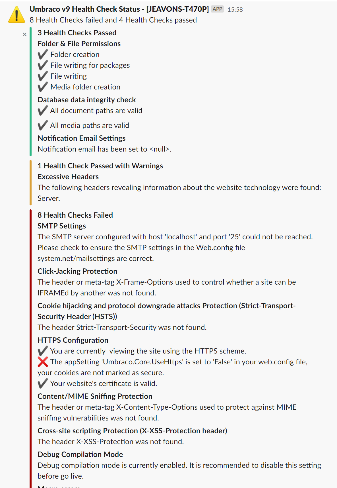

# Umbraco Slack Heath Check Notification #


This package adds a Health Check Slack Notification Method to Umbraco v7.7+ so that the status of Health Checks can be posted to a specific Slack Channel.

## Installation ##

Both NuGet and Umbraco packages are available. 

|NuGet Packages    |Version           |
|:-----------------|:-----------------|
|**Release**|[](https://www.nuget.org/packages/Our.Umbraco.HealthCheckSlackNotificationMethod/)
|**Pre-release**|[](https://www.myget.org/feed/umbraco-packages/package/nuget/Our.Umbraco.HealthCheckSlackNotificationMethod/)

|Umbraco Packages  |                  |
|:-----------------|:-----------------|
|**Release**|[](https://our.umbraco.org/projects/backoffice-extensions/slack-health-check-notification/) 
|**Pre-release**| [](https://ci.appveyor.com/project/JeavonLeopold/umbraco-healthcheckslacknotificationmethod/build/artifacts)

Once installed you will need to **add your settings into the HealthChecks.config** file found in the config folder

You will need to create a [Slack Incoming Webhook](https://my.slack.com/services/new/incoming-webhook/) and copy the Webhook URL to the config file. 

## Configuration ##

**v2.0.0-beta1** requires manual configuration. Edit `/config/HealthChecks.config` to add the notification method and enable notifications. You need to replace the settings with your own web hook URL and channel. Your complete config file should look the below:

```xml
<HealthChecks>
  <disabledChecks>
    <!--<check id="1B5D221B-CE99-4193-97CB-5F3261EC73DF" disabledOn="" disabledBy="0" />-->
  </disabledChecks>
  <notificationSettings enabled="true" firstRunTime="" periodInHours="24">
    <notificationMethods>
      <notificationMethod alias="email" enabled="false" verbosity="Summary">
        <settings>
          <add key="recipientEmail" value="" />
        </settings>
      </notificationMethod>
      <notificationMethod alias="slack" enabled="true" verbosity="Detailed" failureOnly="true">
        <settings>
          <add key="webHookUrl" value="https://hooks.slack.com/services/XXXXXXXXXXX/XXXXXXXXXX/XXXXXXXXXXXX"/>
          <add key="channel" value="#mychannel"/>
          <add key="username" value="Umbraco v8 Health Check Status"/>
        </settings>
      </notificationMethod>
    </notificationMethods>
    <disabledChecks>
      <!--<check id="EB66BB3B-1BCD-4314-9531-9DA2C1D6D9A7" disabledOn="" disabledBy="0" />-->
    </disabledChecks>
  </notificationSettings>
</HealthChecks>
```



# Credits and references

This project includes [Slack.Webhooks](https://github.com/nerdfury/Slack.Webhooks) which is MIT licensed.